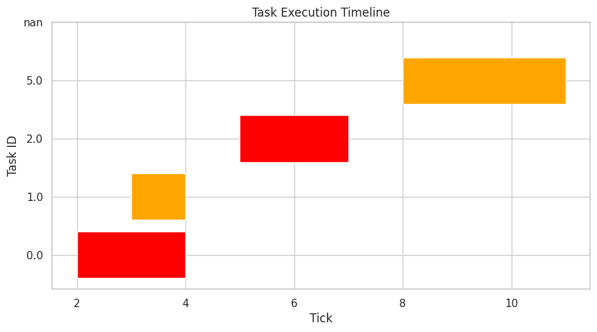

# RTOS Sensor Network Simulation
[](https://github.com/Arief-AK/RTOS-Design-for-Simulated-Sensor-Network-Coordination/actions/workflows/cmake-multi-platform.yml)

A C++ implementation of a real-time operating system (RTOS) simulation for coordinating sensor networks.

## Overview
This project simulates a real-time operating system designed for sensor network coordination. It implements core RTOS components including:

### Schedulers
- Priority
- [Rate Monotonic (RM)](https://en.wikipedia.org/wiki/Rate-monotonic_scheduling)
- [Earliest Deadline First (EDF)](https://en.wikipedia.org/wiki/Earliest_deadline_first_scheduling)

### Kernel Features
- Task control and management (with preemption)
- [Circular buffer](https://en.wikipedia.org/wiki/Circular_buffer) task management
- Metric logging functionality

### Simulation Features
- Producer-consumer task simulation strategy

## Building the Project

### Prerequisites
- CMake (version 3.10 or higher)
- C++17 compatible compiler
- Make

### Build Instructions
```bash
mkdir build
cd build
cmake ..
make
```

## Scheduler-Task Visualisations
This project produces visualisations to review functionality and performance of the schedulers.

>[!NOTE]
>
>This project uses Python visual libraries to produce scheduler visualisations. Python's [virtual environment (venv)](https://docs.python.org/3/library/venv.html) is used to encapsulate the required environment to prodcue visualisations.

Create a new virtual environment
```shell
python3 -m vevn .venv
```

Activate the virtual environment
```shell
source .venv/bin/activate
```

Install dependencies with `pip`
```shell
pip install -r requirements.txt
```

Run the [Visualisation.py](visualisation/version-2.0/Visualisation.py) script
```shell
python visualisation/version-2.0/Visualisation.py
```

The visualisations is stored in `visualisation/version-x.x/results/`.

>[!NOTE]
>
>## Sample Images
><details>
>All images produced from the `PriorityScheduler`.
>
> 
>
> 
>
> 
></details>